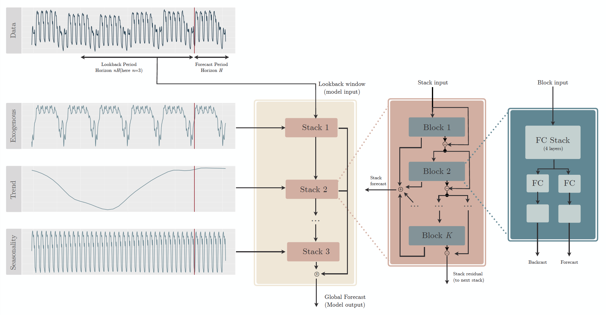

# NBEATSx: Neural basis expansion analysis with exogenous variables
We extend the NBEATS model to incorporate exogenous factors. The resulting method, called NBEATSx, improves on a well performing deep learning model, extending its capabilities by including exogenous variables and allowing it to integrate multiple sources of useful information. 
To showcase the utility of the NBEATSx model, we conduct a comprehensive study of its application to electricity price forecasting (EPF) tasks across a broad range of years and markets. 
We observe state-of-the-art performance, significantly improving the forecast accuracy by nearly 20\% over the original NBEATS model, and by up to 5\% over other well established statistical and machine learning methods specialized for these tasks. Additionally, the proposed neural network has an interpretable configuration that can structurally decompose time series, visualizing the relative impact of trend and seasonal components and revealing the modeled processes' interactions with exogenous factors.

This repository provides an implementation of the NBEATSx algorithm introduced in [https://arxiv.org/pdf/2104.05522.pdf].
<div style="text-align:center">

</div>

## Electricity Price Forecasting Results
The tables report the forecasting accuracy for the two years of test, using the ensembled models in the Nord Pool market. 
The results for the Pennsylvania-New Jersey-Maryland, Belgium, France and Germany markets are available in the paper.

| METRIC       |    AR |   ESRNN |   NBEATS |   ARX |   LEAR |   DNN |   NBEATSx-G |   NBEATSx-I |
|:-------------|------:|--------:|---------:|------:|-------:|------:|------------:|------------:|
| MAE          |  2.26 |    2.09 |     2.08 |  2.01 |   1.74 |  1.68 |        1.58 |        1.62 |
| rMAE         |  0.71 |    0.66 |     0.66 |  0.63 |   0.55 |  0.53 |        0.5  |        0.51 |
| sMAPE        |  6.47 |    6.04 |     5.96 |  5.84 |   5.01 |  4.88 |        4.63 |        4.7  |
| RMSE         |  4.08 |    3.89 |     3.94 |  3.71 |   3.36 |  3.32 |        3.16 |        3.27 |

### NBEATSx usage
Our implementation of the NBEATSx is designed to work on any data. We designed a full pipeline with auxiliary objects, namely Dataset and DataLoader, to facilitate the forecasting task. We provide an example notebook in [nbeatsx_example.ipynb](https://github.com/cchallu/nbeatsx/blob/main/nbeatsx_example.ipynb)

### Run NBEATSx experiment from console
To replicate the results of the paper, in particular to produce the forecasts for NBEATSx, run the following line:
```console
python src/hyperopt_nbeatsx.py --dataset 'NP' --space "nbeats_x" --data_augmentation 0 --random_validation 0 --n_val_weeks 52 --hyperopt_iters 1500 --experiment_id "nbeatsx_0_0"
```
We included the forecasts for all the markets and models in the results folder. The notebook [main_results.ipynb](https://github.com/cchallu/nbeatsx/blob/main/main_results.ipynb) replicates the main results table and GW test plots.

## License
This project is licensed under the MIT License - see the [LICENSE](https://github.com/cchallu/nbeatsx/blob/main/LICENCE) file for details.

## Citation

If you use NBEATSx, please cite the following paper:

```console
@article{olivares2021nbeatsx,
  title={Neural basis expansion analysis with exogenous variables: Forecasting electricity prices with NBEATSx},
  author={Olivares, Kin G and Challu, Cristian and Marcjasz, Grzegorz and Weron, Rafa{\l} and Dubrawski, Artur},
  journal = {International Journal of Forecasting, submitted},
  volume = {Working Paper version available at arXiv:2104.05522},
  year={2021}
}
```
